# Alumni Connect

A Flutter mobile application for alumni networking, events, donations, and more.

## Features

- **Authentication**: Email/password and Google Sign-In
- **Alumni Directory**: Browse and connect with alumni
- **Feed/Posts**: Create posts, like, and comment
- **Messaging**: Direct messages between alumni
- **Notifications**: Push notifications via Firebase Cloud Messaging
- **Events Calendar**: View and RSVP to alumni events
- **Jobs & Mentorship**: Job listings and mentorship opportunities
- **Donations**: Support infrastructure and computer labs
- **Profile Management**: Edit profile, settings, privacy options

## Setup

### Prerequisites

- Flutter SDK (3.0+)
- Firebase project
- Android Studio / Xcode for emulators

### Firebase Configuration

1. Create a project at [Firebase Console](https://console.firebase.google.com)
2. Enable Authentication (Email/Password and Google)
3. Create Firestore Database
4. Enable Storage
5. Enable Cloud Messaging

6. **Android**: Download `google-services.json` and place in `android/app/`
7. **iOS**: Download `GoogleService-Info.plist` and add to `ios/Runner/`

### Firestore Security Rules (Development)

```javascript
rules_version = '2';
service cloud.firestore {
  match /databases/{database}/documents {
    match /users/{userId} {
      allow read: if request.auth != null;
      allow write: if request.auth.uid == userId;
    }
    match /posts/{postId} {
      allow read: if request.auth != null;
      allow create: if request.auth != null;
      allow update, delete: if request.auth.uid == resource.data.userId;
    }
    match /events/{eventId} {
      allow read: if request.auth != null;
      allow write: if request.auth != null;
    }
    match /donations/{donationId} {
      allow read: if request.auth != null;
      allow write: if request.auth != null;
    }
    match /conversations/{convId} {
      allow read, write: if request.auth != null;
    }
    match /jobs/{jobId} {
      allow read: if request.auth != null;
      allow write: if request.auth != null;
    }
    match /connections/{connId} {
      allow read, write: if request.auth != null;
    }
    match /notifications/{notifId} {
      allow read, write: if request.auth != null;
    }
  }
}
```

### Seed Data (Optional)

Add sample events and donations in Firestore:

**events** collection:
```json
{
  "title": "Winter Sports Meet",
  "description": "Annual alumni sports event",
  "date": "2026-03-20T00:00:00Z",
  "time": "10:00 AM",
  "location": "College Ground"
}
```

**donations** collection:
```json
{
  "category": "Computer Labs",
  "title": "Donate for computer labs",
  "description": "Help upgrade our computer labs",
  "targetAmount": 100000,
  "collectedAmount": 0
}
```

### Run the App

```bash
flutter pub get
flutter run
```

## Project Structure

```
lib/
├── config/          # Theme, constants
├── models/          # Data models
├── providers/       # State management (Provider)
├── screens/         # UI screens
├── services/        # Firebase, API services
├── utils/           # Validators, helpers
├── widgets/         # Reusable widgets
└── main.dart
```

## Design

- **Theme**: Red (#8B1538) and white
- **Architecture**: MVVM with Provider
- **Navigation**: Bottom nav (Home, Connections, Search, Events, Profile) + Drawer

## Screenshots

### User App:

#### Auth screens-
|   Login Screen   | Signup Screen |
|------------------|-----------------|
| 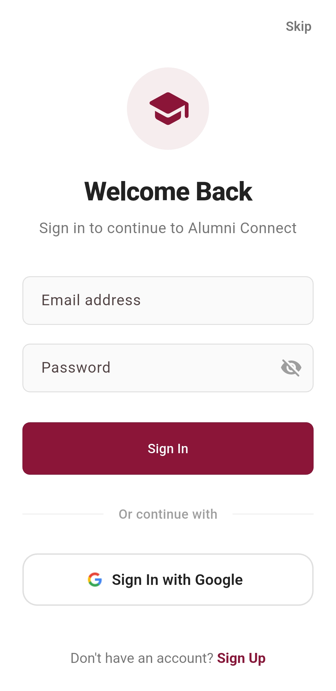 | 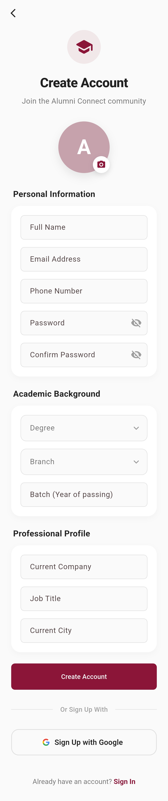

#### Bottombar Screens-
| Home Screen | Feed Screen | Messages Screen | Events Screen | Profile Screen |
|------------------|------------------|------------------|------------------|------------------|
| 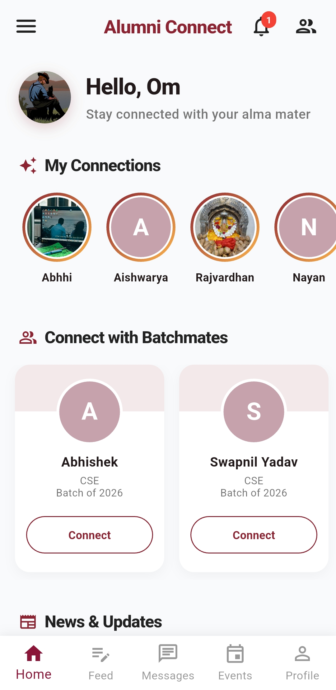 | 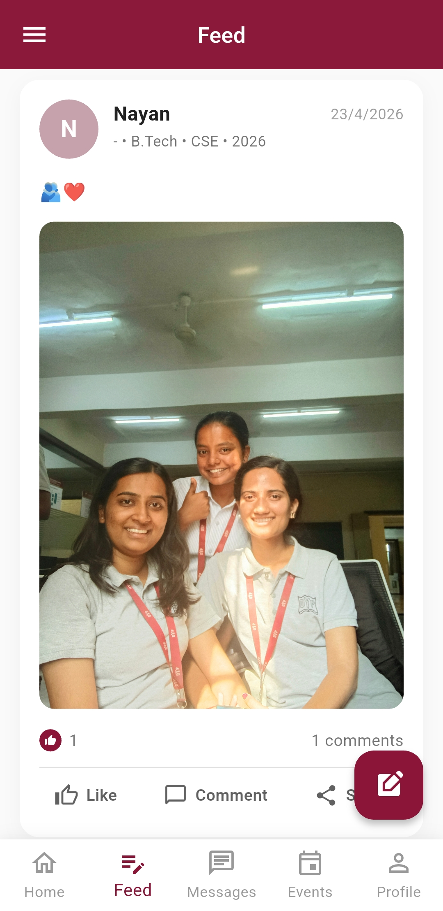 | 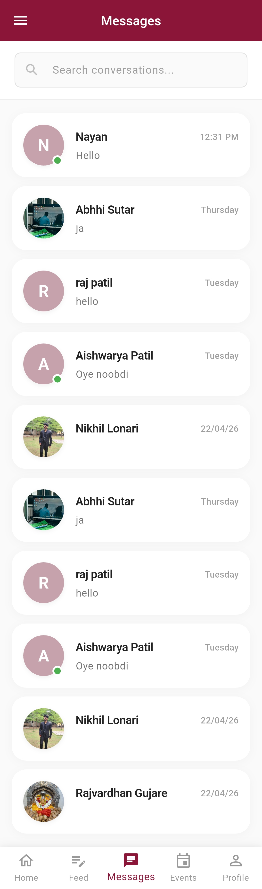 | 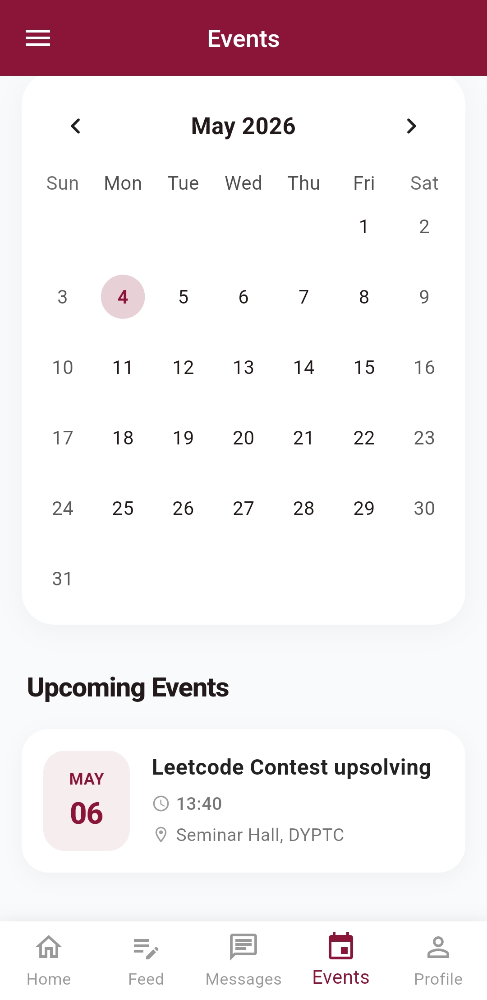 |  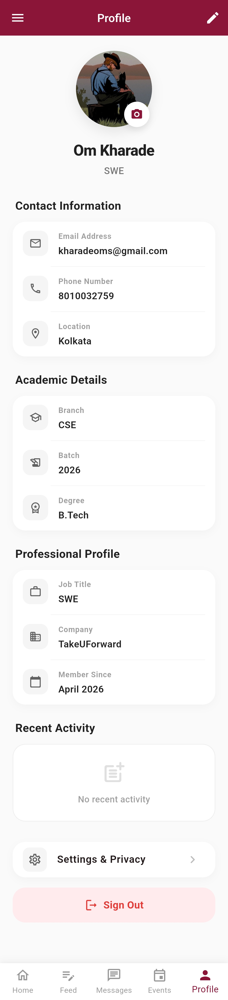 |
| 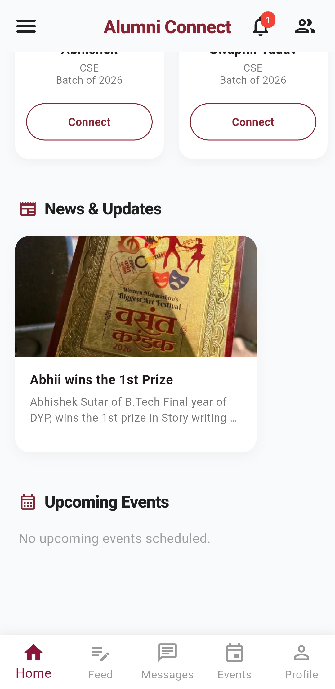 | 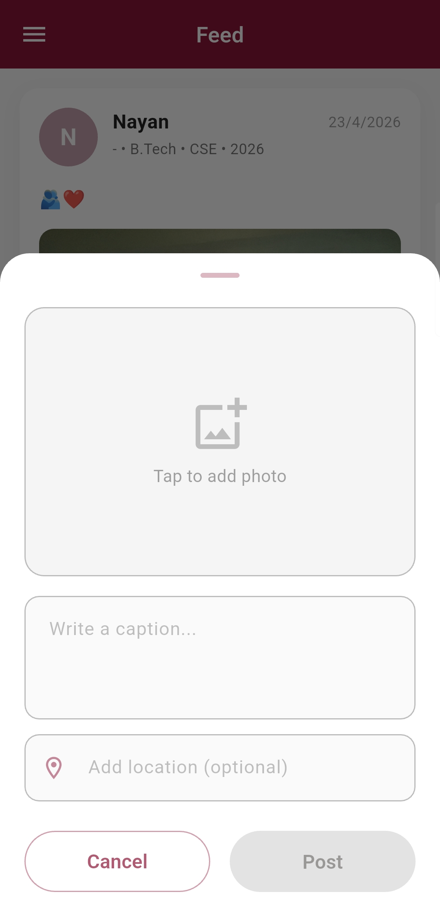 | 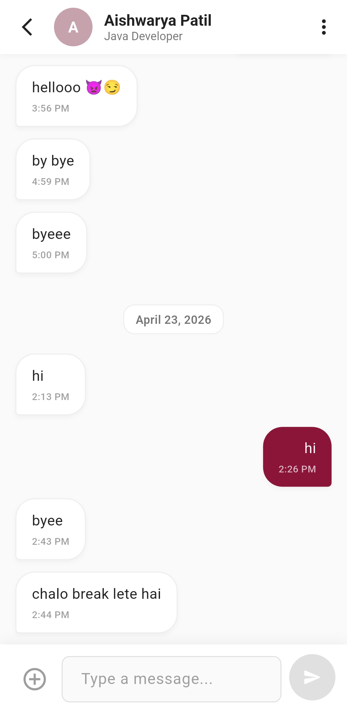 |  | 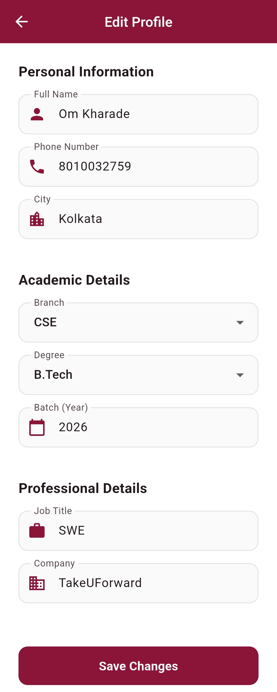 |

#### Drawer Screens-
|  Drawer  |   Alumni Directory   |  My Connections  | Job & Mentorship | News & Updates | Campaigns & Donate |
|------------------|------------------|------------------|------------------|------------------|------------------|
| 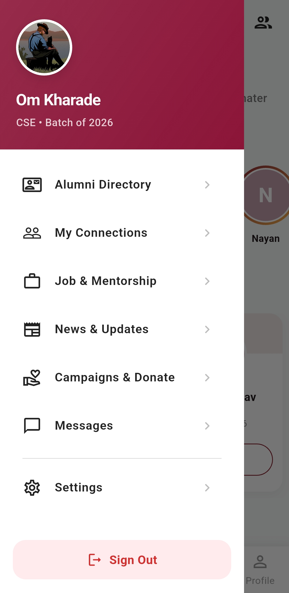 | 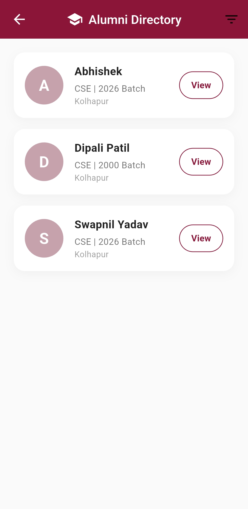 | 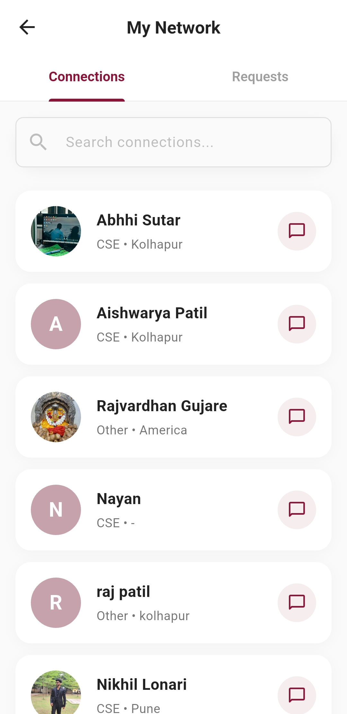 | 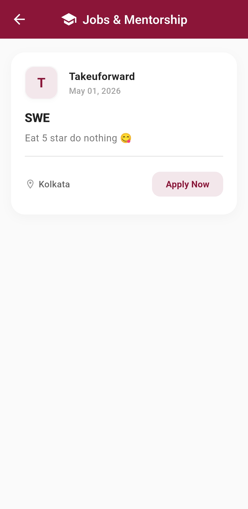 | 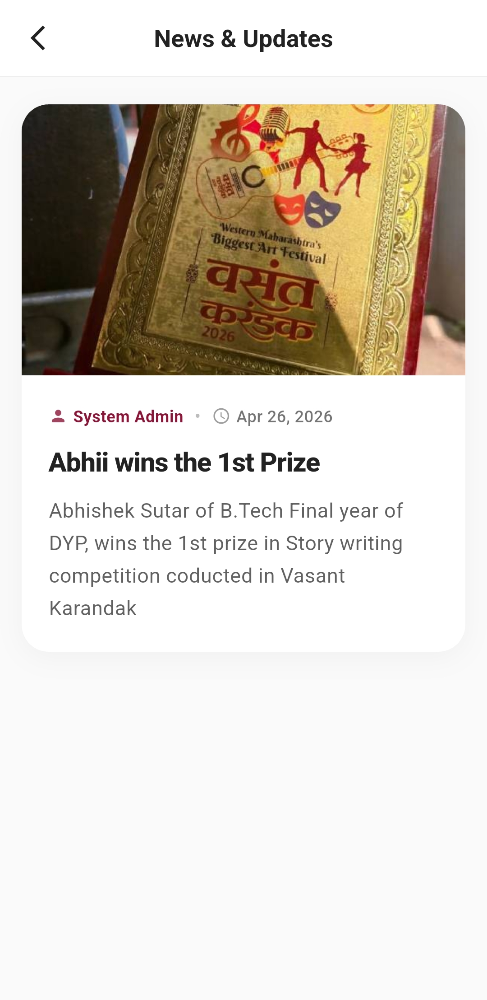 |  |
